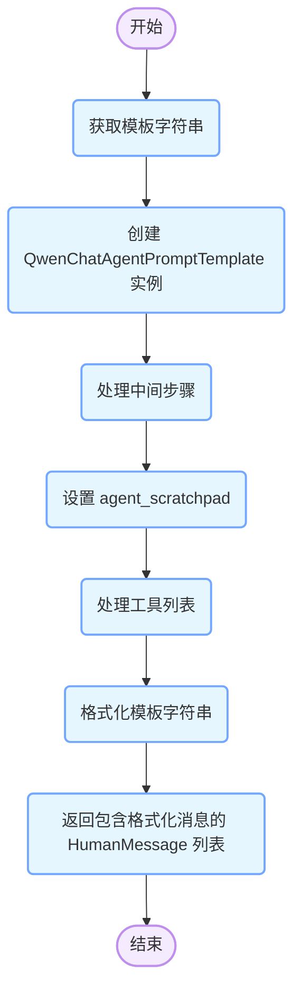

```mermaid
flowchart TB
    classDef startend fill:#F5EBFF,stroke:#BE8FED,stroke-width:2px
    classDef process fill:#E5F6FF,stroke:#73A6FF,stroke-width:2px
    classDef decision fill:#FFF6CC,stroke:#FFBC52,stroke-width:2px
    
    A([开始]):::startend --> E(获取模板字符串):::process
    
    E --> F(创建 QwenChatAgentPromptTemplate 实例):::process
    F --> G(处理中间步骤):::process

    G --> H(设置 agent_scratchpad):::process
    H --> J(处理工具列表):::process
    %% I --> J(创建工具名称列表):::process
    J --> K(格式化模板字符串):::process
    K --> L(返回包含格式化消息的 HumanMessage 列表):::process
    G
    L --> M([结束]):::startend
```